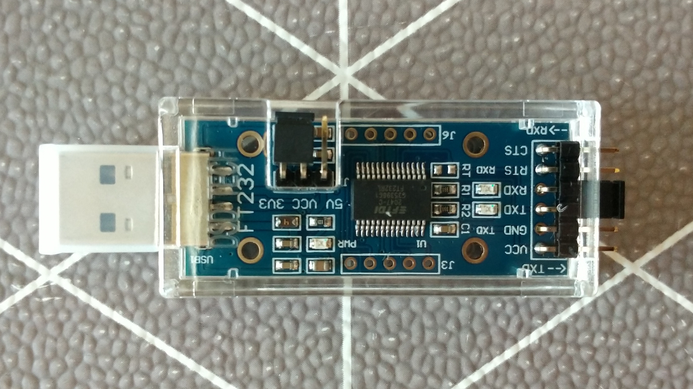

# Instalación
## 1. Conexión del relé
Para subir el código al relé, necesitamos conectarlo a un ordenador. Para esto podemos utilizar un adaptador USB-TTL, ya que el relé tiene accesibles los pines del puerto serie y podemos conectarnos a ellos fácilmente.

Mientras que lo óptimo sería soldar unos pines, como solo es necesario conectar el relé la primera vez, y luego se puede subir el código a través de la red, simplemente pongo los cables en los pines y le doy la vuelta al relé para hacer que los pines hagan contacto y subir el código.

Dicho eso, con este método, es mejor tener cuidado de no dejar que los pines se toquen, porque freír el relé o el adaptador no sería agradable (no creo que, en ningún caso, el USB del ordenador se estropeara, porque suelen estar protegidos, pero no lo probaría).

_⚠ No conectes el relé a la red eléctrica mientras que esté conectado al adaptador o fuera de la carcasa, simplemente sube el código y comprueba que funciona. Después puedes ponerlo otra vez en la carcasa y conectarlo_

## 2. Instalación de esphome
Esphome se puede instalar en docker o con pip dentro de un entorno virtual. Las instrucciones para hacer eso se pueden encontrar [aquí](https://esphome.io/guides/installing_esphome.html) o [aquí para docker](https://esphome.io/guides/getting_started_command_line.html), pero estos son los pasos para instalarlo dentro de un entorno virtual con pip:
```
python3 -m venv venv
. venv/bin/activate
pip install esphome
```

## 3. Cargarndo el script
El script se puede cargar con el siguiente comando en una shell con el venv y en el directorio correspondiente
```
esphome run sonoff.yml
```

## 4. Modificando el script
### 4.1. Modificando el temporizador
Los intervalos en los que se enciende y se apaga el relé se definen en el script con la sintaxis de cron. Si quieres ver qué hacen diferentes cadenas, puedes verlo en [crontab.guru](https://crontab.guru), pero explicaré como hacerlo rápidamente.

Lo que define la hora es la cadena después de `cron`, que se parece a algo así: `30 30 23 * * 1-5`. Esto significa, a las once y media y treinta segundos de domingo a lunes:

- El primer número es el segundo
- El segundo número es el minuto
- El tercer número es la hora
- El cuarto número es el día del mes
- El quinto número es el número de mes
- El sexto número es el día de la semana

_ℹ Algunas veces, solo hay cinco caracteres, cuando no hay segundo y el primer valor son los minutos_

Estos valores pueden ser:

- Un número. Para el día de la semana, en este caso 1 es domingo, mientras que 0 suele ser domingo, así que tenlo en cuenta
- Un asterísco, que significa todos los valores, por ejemplo, si el día del mes es un asterísco, la acción se ejecutará todos los días del mes con la frecuencia determinada por el resto de parámetros
- Una fracción en la forma  `*/5`, que en este caso, si se pone en las horas, sería cada cinco horas
- Un rango en la forma `10-22`, lo que significa, si se pone en las horas, de 10 a 22.
- Una lista. `1,3,5`, que sería en los minutos 1, 3 y 5

Con eso, deberías de poder modificar las horas a las que se realizan las automatizaciones, e incluso añadir más, simplemente ten en cuenta que cuando añadas automatizacioines en tu servidor, la varíable de día de la semana sería la del archivo de esphome +1, y que ahí no necesitas los segundos.
