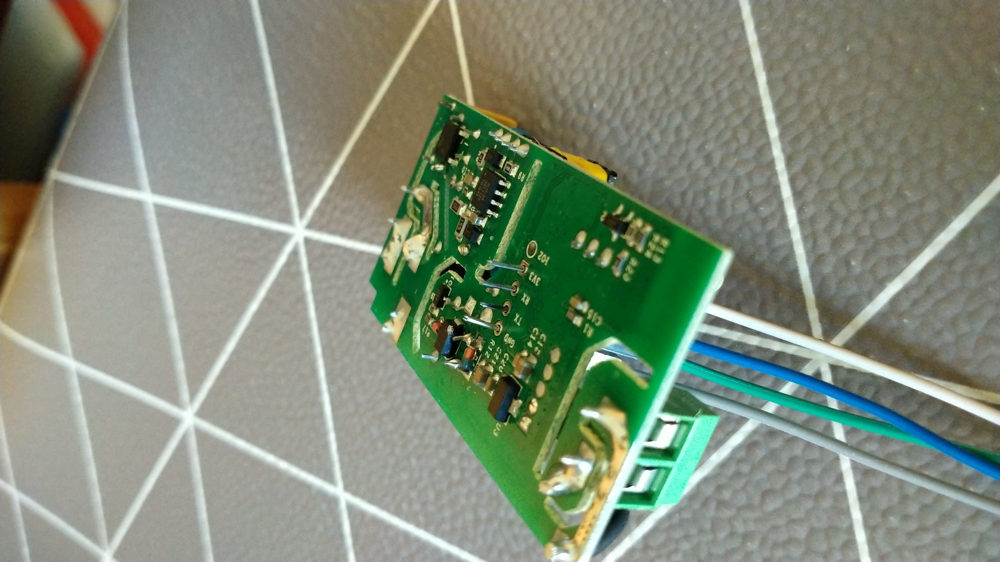

# Instalation
## 1. Connecting the relay
To upload the code to the relay, we need to connect it to a computer. For this, we can use an USB-TTL adaptor, as the sonoff basic relay exposes its esp8285's serial pins, so when can connect to them easily.

While soldering some pins would be optimal, as connecting the relay is only needed the first time, after which the code can be uploaded OverTheAir (if enabled), so I just put the cables into the pins and turn the relay upside down, so the pins make contact and upload the code.

That being said, when using this method, is better to be careful not to let the pins touch with each other, as frying the relay or the adaptor would not be optimal (I don't think that, in any case, the computer's USB ports would be damaged, as they're usually well protected, but I wouldn't try).

_⚠ Don't connect the relay to mains power while connected to the adaptor or while disassembled, just upload the code and test that it works, after which you can put it back in its case and get it connected_

## 2. Installing esphome
Installing esphome can be done, either using docker or with pip inside a virtual environment. The instructions for doing this can be found [here](https://esphome.io/guides/installing_esphome.html) or [here for docker](https://esphome.io/guides/getting_started_command_line.html), but these are the simple steps to install it inside a virtual environment with pip:
```
python3 -m venv venv
. venv/bin/activate
pip install esphome
```

## 3. Uploading the script
Uploading the script can be done with the following command in a shell with the venv and in the corresponding directory:
```
esphome run sonoff.yml
```

## 4. Modifying the script
### 4.1. Modifying the timer
The intervals on which the relay is turned on an off are defined in the script with the cron syntax. If you want to see what different string do, you can check it in [crontab.guru](https://crontab.guru/), but I will explain how it works briefly.

What defines the time is the string after `cron`, which looks something like this: `30 30 23 * * 1-5`. This means, at half past eleven and 30 seconds from sunday to monday:

- The first number is the second
- The second number is the minute
- The third number is the hour
- The fourth number is the day of the month
- The fith number is the month number
- The sixth number is the day of the week

_ℹ Sometimes, there is only five characters, when there isn't seconds and the first value is already the minutes_
These values can be:

- A number. For the day of week, in this case 1 is sunday, while usually 0 is sunday, so keep this in mind
- An asterisk, meaning all values, for example, if the day of month is an asterisk, the action will be executed every day with the frecuency determined by the rest of parameters
- A fraction in the form `*/5`, which in this case, if put in hours, it would mean every five hours
- A range in the form `10-22`, which would mean, if put in hours, every hour from 10AM to 10PM
- A list. `1,3,5`, wich would mean at minutes 1, 3 and 5

With that, you should be able to modify the hours at which automations happen, and even add more, just keep in mind that when adding the automations to your server, the days of week variable will be that of the esphome file +1, and that you don't need seconds there.
